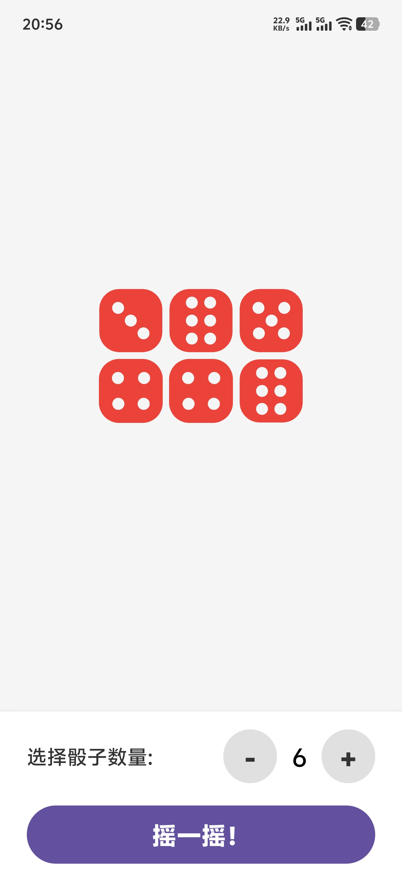

# 🎲 摇了么 (PartyDice) 

> 一款专为聚会、酒局打造的沉浸式 Android 摇骰子应用。抛弃繁琐的操作，只需拿起手机摇一摇，伴随着真实的音效和震动，体验最纯粹的乐趣！

[](https://developer.android.com)
[](https://kotlinlang.org/)
[](LICENSE)

## 📸 效果预览

 

## ✨ 核心功能 (Features)

- 🎛️ **极简丝滑的操控**：告别呼出软键盘的繁琐，底部专属 `+` `-` 按钮，单手一秒切换 1~15 个骰子。
- 📱 **物理外挂（重力感应）**：接入 Android 底层加速度传感器（Accelerometer），像握着真实骰盅一样用力摇晃手机，即可自动触发掷骰子！
- 🔊 **沉浸式听觉体验**：内置真实的摇骰子物理碰撞音效，一秒带入酒局氛围。
- 📳 **细腻的触觉反馈**：调用系统震动马达（Vibrator），摇晃期间极高频轻震（模拟撞击杯壁），落定瞬间重震（模拟落桌定音），手感拉满。
- 🎨 **自适应动态 UI**：无论生成多少个骰子，都能在屏幕中央完美网格对齐，超出屏幕自动支持丝滑滚动。

## 🛠️ 技术栈 (Tech Stack)

本项目作为 Android 新手入门的绝佳实践，涵盖了以下核心技术点：
- **开发语言**: Kotlin
- **UI 布局**: 原生 XML (LinearLayout, ScrollView, GridLayout 权重自适应布局)
- **硬件交互**: `SensorManager` (重力传感器算法解析)
- **多媒体**: `MediaPlayer` (音频播放与生命周期管理)
- **系统服务**: `Vibrator` / `VibratorManager` (跨版本震动适配)
- **动画逻辑**: `CountDownTimer` 配合视图属性动画

## 🚀 如何运行本项目

1. 确保你的电脑上已安装最新版的 [Android Studio](https://developer.android.com/studio)。
2. 克隆本仓库到本地：
   ```bash
   git clone git@github.com:JMbaozi/PartyDice.git
   ```
3. 使用 Android Studio 打开该项目文件夹。
4. 等待 Gradle 同步完成后，点击顶部的绿色 **Run** 按钮，即可在模拟器或真机上运行。

## 📦 下载安装包体验

如果你只想体验这款 App，可以直接在 [Releases 面板](https://github.com/JMbaozi/PartyDice/releases/tag/v1.0) 下载最新的 `.apk` 安装文件，发送到你的安卓手机上安装即可。

## 📅 未来规划 (To-Do List)

* [ ] 增加“自动计算总点数”的作弊小功能。
* [ ] 增加“大话骰（吹牛）”模式的防偷窥不透明遮罩。
* [ ] 支持更换骰子皮肤。

## 🤝 贡献与反馈

如果你有任何建议和想法，非常欢迎提交 **Issue** 或 **Pull Request**！


